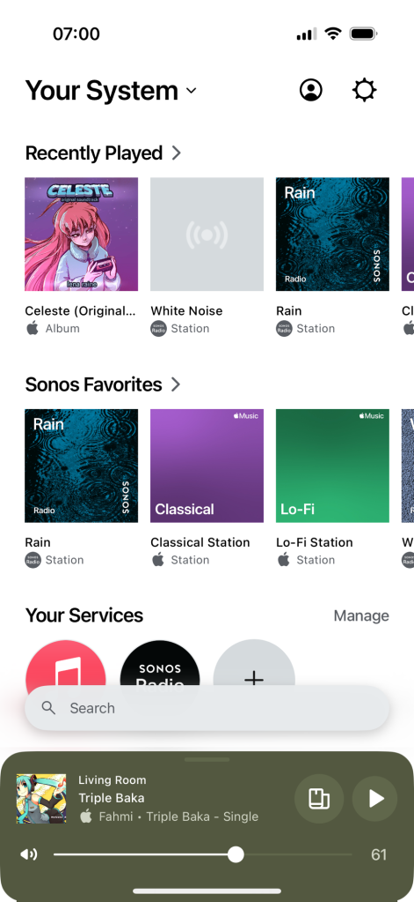

So, a while ago, there was this huge uproar over this company called Sonos, which is a manufacturer of wireless speakers, mainly because of a new version of their app that they deployed,

While the whole idea of this uproar was essentially to stay away from the speakers, it drew me in closer to the idea for some reason.

Basically, to talk about what makes Sonos speakers unique, there's a little bit of background. In addition to being relatively high quality speakers (disclaimer: I'm not an audiophile, nor am I affiliated with Sonos), Sonos speakers are essentially within their own ecosystem that consists of speakers capable of having their audio playback grouped, ungrouped, and transferred between speakers. If this sounds familiar to what AirPlay (also available on speakers) or what select Google Cast devices can do, that's probably because Sonos was the one to popularize the concepts behind it.

What separates Sonos from these devices however, is that unlike these services. Sonos speakers play audio directly from a streaming source. Which can be configured to either be a popular streaming service, or a local SMB library of your own music, and this is mostly the only thing they do. In addition, these speakers aren't just individual endpoints to play to, multiple of the same speaker can be setup to work as if it was a stereo system. Essentially, these speakers let you create an entire home audio system without the need for excessive wiring or drilling through your home.

The app itself functions essentially as an audio remote, as well as the main place to manage the settings for your speakers and quickly setup new ones.

<figure>

<figcaption>

The Sonos app is fairly simple. It’s primary purpose serving as a controller for your audio. With the media player at the bottom pulling out to reveal all the speakers on your network. Changing the output to another controlled device is as simple as tapping it from the list.

</figcaption>

</figure>

Despite needing to create an account for speaker setup and music streaming linking, the app has no cloud connection to it unlike most IoT apps. Meaning that you need to be connected to the same network as the speakers in order to control them and adjust their settings. However, other users can also download and join an existing system to their app, as well as start playing and controlling audio without needing to sign in or create an additional account (signing in is needed in order to adjust settings, however)

One of the major benefits Sonos puts off about their app is the fact audio can continue playing, even while there’s a phone call. Since the app doesn’t rely on any system media players and simply streams the audio directly to the speaker. I’ve personally found the app a lot nicer for playing streaming radio stations (something I can get through Apple Music as well as their own in-house, Ad supported, radio service. The latter I only really use for the Ad-free white noise and rain stations)

While I've never seen the original app, I can tell that the new app is likely built on some cross platform framework, and, while not as drastic as some users have complained (much of the work at Sonos had gone into damage control over the app as newer products were pushed aside, so it's likely many of the greater issues had been worked out), I have had a few hiccups here and there with the mobile apps.

## Other features

Music playback aside, the app lets you set up quite a few other features as well. For example, alarms can be setup within the app. Which basically just play a predetermined song at a certain time. There's also sleep timers that can be setup as well, which basically work like most sleep timers on other platforms where the song fades out after a set amount of time.

The speakers themselves also work with Apple AirPlay, allowing Apple devices to cast audio to them, or asking a HomePod to play audio in a specific room. And can be setup to be controlled from Alexa, as well as Apple and Google Home. The former being a little more limited, and can only actually control playback from speakers currently using AirPlay.

One of the other features that can be setup is Trueplay, which as an equalizer that is setup either using an iphone held upside down and waved around the room, or by using a speakers built in microphones to measure the acoustics of a room, and adapt the audio to it. Whether or not you hear any enhancements will depend on the shape and size of your room, as well as the method of calibration you use. I personally found the former to sound a _lot_ better.

The aforementioned microphones also can double up for speech recognition with a voice assistant. With Alexa being the main supported one through the Alexa built-in program. While I don't actively use Alexa in my home. Alexa on the Sonos speaker is better suited as being a satellite to a home already using an Amazon Echo as opposed to being the main set of devices due to the inability for a Sonos speaker to function as a Matter controller for neither Wi-Fi nor Thread.

In addition to Alexa, Sonos also maintains their own in-house assistant as well called Sonos voice control. It mainly just functions as a companion to the main app, letting you perform some of the most common functions of it with our the need to actually open it. But other than that and a few other minor things, that’s mostly all it does.

## API

In my opinion, one of the biggest saving graces to Sonos over the app fiasco was their well crafted local API. While they do have a separate cloud based API for more cloud based control (such as creating content providers the speakers can stream from, or 3rd party web apps), there’s a more local API as well relying on open standards like UPnP. While it’s not as documented as their cloud API’s, it’s still great that the speakers even have such a local API. While it won’t really save anyone if the company shuts its doors and all the cloud functions go offline. It still gives more ways for other apps to latch on.

One of these apps is on my list of favorites… Home Assistant. Sonos is actually a featured integration within HA. And the experience really shows as speakers are automatically discovered and added, and also update in real time. Including a couple of HACS cards that can even show you the exact playback time on a speaker.

Ironically, while writing this. The Sonos API documentation introduction has actually given me a better understanding of what Sonos products do compared to their actual marketing pages.

## Verdicts

Personally, I would recommend Sonos to anyone with an Apple device, or anyone who is looking for something more streamlined for music compared to the bells and whistles of most smart speakers.

Compared to the competition of other smart speakers. The speakers can seem much more limited at a much higher cost. But overall, Sonos is really a product category that isn't really in that of smart speakers Like Echo or HomePod. It's not just a regular Bluetooth speaker (though some do have that functionality), but being an assistant isn't it's goal either.

I have found Sonos speakers much better for playing audio in part thanks to their well designed (if not well coded) app. And it feels like a device I actually want to play music to (and feel a twinge of guilt constantly that I'm not making the most of the one sitting on my desk aside from falling asleep to white noise). While AirPlay suggestions on iPhone make it a little easier to find a device to play music to, casting from any device can sometimes be frustrating (especially during the process of disconnecting). Considering the way you get most smart speakers to play music is by asking for a specific song, which can be wishing upon a star sometimes as you get the same song, but from a different album, or another song entirely. If all you are wanting to do at a given moment is just play something around the house, the app feels really well designed for that, even if it requires a few extra seconds of grabbing your phone. And the fact I can share that ability with my family, without the need for them to go through the process of signing up, was a really great design choice.

My only real concerns about Sonos have been a few class action lawsuits around the company and some general uncertainty around the amount of security updates products get, but other than that. They do work exceptionally well, and I wish I had the ability to acquire more of the speakers for my home.
