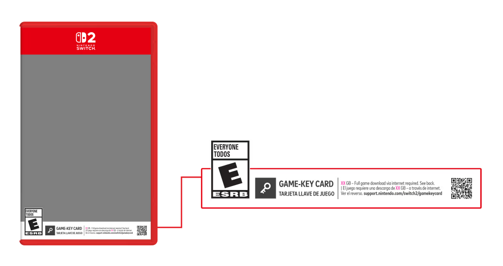

As the Nintendo Switch 2 nears release in a few weeks, there's been a growing ire over a new element that Nintendo has decided to introduce to the console.

This is the concept of Game Key Cards:

<figure>

<figcaption>

Game Key Cards get a very large disclaimer at the bottom of the art reminding you that, similar to some of the physical DLC codes, they don't contain any actual code or game data on the cartridge itself.

</figcaption>

</figure>

Typically, most Nintendo Switch games include all the base data for the game right on the cartridge itself, if there isn't any updates needed, you can just plug it in and start playing. Of course, you can also use the internal storage or a microSD card to purchase a game on the Nintendo eShop, and download it to your system as well. Using the Virtual Game Card system, you can download software to a device, and transfer the license between systems.

Similar to the concept of Virtual Game Cards (an element that took me an excruciatingly long amount of time to setup to play the Pokémon Scarlet DLC due to having to grab my 2 Switches, update them, convert them to the new system, then link them together). Game Key Cards are meant to represent games that simply contain a license for the actual software. Just like Virtual Game Cards, they don't contain any actual game data and require an internet connection for download, storage space for storing the actual game, and that the cartridge be inserted into the system for the software to be able to launch and function.

If it sounds familiar, it's probably because it's what a majority of Nintendo's competitors are doing for most titles. The disk contains an excruciatingly small amount of data, and the system downloads the game to the consoles internal storage. The only difference with Nintendo is that they continuing to sell some games as coming completely on cartridge, while others will be sold in a similar fashion to the competition.

Now, despite being similar to what the competition is already doing, the concept of Game Key cards has been controversial with fans. Many vowing they will never purchase a game that uses these.

## The purpose of physical games

Despite it all, physical games still have a big purpose. Choosing to avoid digital games entirely is a valid consumer decision. Not everyone would like to handle the trouble of buying a special microSD card for their device, and some just hate the idea of managing storage at all. After all, why worry about having to uninstall games to make room for more when you can just attach and detach games as hot swappable hardware modules? Not to mention the ability to resell games if you wish.

In addition, many cultures favor the gifting of actual, material objects and not something fungible like cash. So physical games sold at department stores like Walmart give the ability for those looking to provide someone with something they like with something they can hold.

In addition, there's also still the digital divide that plagues us. It may not seem like it depending on where you live, but not everyone in the United States has a solid broadband internet connection. And while Satellite Internet and Wireless Internet Service Providers have made increasing expansions across the more rural areas of the US, they still have their limits. And don't always work reliably.

## Preservation Pitfalls

I'll admit, I've been on the side that doesn't care as much about video game preservation becoming a challenge. Mainly because fans, given enough time, have always managed to find a way to get through software and do it themselves. Whether that's through the use of reverse engineering to create a private server, an emulator, or any other hardware that could be used to help keep a collection of games safe and playable. The bigger threats are not being able to download software at all. And, while this is an obvious barrier to the aforementioned preservation (and one of the possible problems with Game Key Cards). An even bigger threat exists in the fact that the companies responsible for developing these systems are also responsible for letting you even _run_ the games in the first place.

One experience that will always resonate with me, and has warped my idea about ownership is as follows:

I used to own an Xbox 360, and I loved Terraria. Owning it across there (as a physical game disk, all the data located on there), and Steam.

One day, we got an Xbox One, a game where you could also purchase an enhanced version of the game for the system. Naturally, being young and not having much money (I had already gotten this game as a birthday gift), I tried inserting it into the Xbox One. Only to be told that the game wasn't compatible with the system despite the Xbox One being compatible with most Xbox 360 games.

Whether or not this was a problem with the game code not running correctly on the newer Xbox, an intentional restriction in place by Microsoft or Redigit, or something else. None of it matters, because I wasn't able to play my game. Which leads me to my next part.

## Physical Ownership ≠ Digital Ownership

Backwards compatibility is a difficult concept. One that intentionally requires sacrificing making better decisions in software development in favor of allowing already existing games to run. It's likely one of the reasons the Switch 2 is just an incremental upgrade as opposed to being a transformation like the GameCube to the Wii (which could still run GameCube games through the use of a GameCube controller plugged into the top of the system).

While this has gotten a lot easier thanks to internal emulation and other forms of containerization. It still requires making a few tradeoffs to the overall design of the system. In Nintendo's case, it's making the system playable with the hundreds of rapid fire release titles they have released over the course of 8 years. And that's not including the thousands more released by third parties.

A game being playable forever means nothing if the systems that run it, or enable it to run, don't exist anymore, or don't work with the other specific components needed to use the software correctly. I already imagine the Switch 2 will likely have issues with Ring Fit Adventure, Nintendo Labo, and possibly even Mario Kart Live: Home Circuit (though far less likely due to it being software to software rather than hardware design).

This is already ignoring concepts like [bit rot](https://en.wikipedia.org/wiki/Data_degradation). The fact that all physical mediums of computer storage will inevitably degrade to a point of being unreadable. But more likely before that, an executive or accountant will decide that activation isn't worth keeping around.

When the PlayStation 5 requires an internet connection to setup its attachable disk drive, it really doesn't mean anything 65 years from now when an unsealed unit is discovered. Long after Sony has decided that the PlayStation 5 activation servers aren't worth keeping around anymore, or perhaps the PlayStation brand entirely.

While the Nintendo Switch may not have anything like Xbox, where specific games don't work, or both Xbox and PlayStation, where you need to pay extra for physical games. Nintendo still has the ability to change anything they want about the way that a Nintendo Switch System operates at any time through an over the air update.

They could choose, if they wanted, in a useless attempt to keep track of where games are going (given physical games already could qualify for gold points at one time), they will require an internet connection for all new games inserted into your system.

Sure, you might need to update your system for this to happen. But what if you need to reset your system at some point? Or perhaps another game you want to play needs an update to work correctly? You are going to have to cave in at some point and choose to update your system for things to continue running smoothly. Or just buy another system entirely (in spite of having an already working one, despite being outdated)

## Closing Thoughts

Overall, I do think that Physical games are a good option for those who want them. However, they aren't the saving grace to video game preservation or ownership like some fans try to make them out to be. It feels extremely trivial that someone can state that a game will be Game Key Card only. And then have tons of comments complaining about said release. And indeed, those on the digital divide will certainly have a problem. But we are also going to have a problem with the things we already own if Nintendo decides to change the way that they already make their existing things work as well.

Instead of exclusively focusing on physical games, we should also be focusing on how companies are going to be handling their existing systems, and getting an idea of a timeline of support for a given system. Games don't work like they did in the 90s, and development companies have managed to pull a lot more rein over their systems than they used to. We have to make sure that they aren't going to throw us over, or they will do it themselves.
